```python
import numpy as np
import matplotlib.pyplot as plt
import seaborn as sns
```


```python
x = np.linspace(-10, 10, 100)
```


```python
plt.style.use('fivethirtyeight')
# plt.xkcd()
```


```python
def plot_graph(x, y, 
               ALPHA=0.6, 
               label_x = "x ->", label_y="act(x) ->", 
               title=None,
               LABEL=None):
    plt.figure(figsize=(7,5))
    plt.axhline(y=0, color="black", linestyle="--", lw=2)
    plt.axvline(x=0, color="black", linestyle="--", lw=2)
    plt.xlabel(label_x)
    plt.ylabel(label_y)
    plt.title(title)

    if LABEL != None:
        plt.plot(x, y, alpha=ALPHA, label=LABEL);
        plt.legend(fontsize=14)

    else:
        plt.plot(x, y, alpha=ALPHA);
```

# **PART I** Activation Function

## 01. Sigmoid


```python
def sigmoid(x):
    return 1 / (1 + np.exp(-x))
```


```python
plot_graph(x, sigmoid(x), title="Sigmoid function", 
           LABEL=r"$\sigma(x) = \frac{1}{1 + e^{-x}}$")
# plot_graph(x, sigmoid(x), title="Sigmoid function", )
```


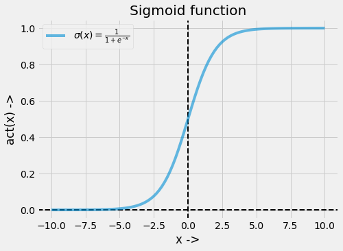


---
## 02. Hard sigmoid

\begin{align}
hard\_sigmoid(x) = \left\{\begin{matrix}
0 & x <-2.5\\  
1 & x>2.5\\  
0.2x + 0.5 & x \in [-2.5, 2.5]
\end{matrix}\right.
\end{align}


```python

```


```python
def hard_sigmoid(x):
    def _hard_sigmoid_def(x):
        if x < -2.5:
            return 0
        elif x > 2.5:
            return 1
        else:
            return 0.2*x + 0.5

    y = []
    for i in x:
        y.append(_hard_sigmoid_def(i))
    return y
```


```python
plot_graph(x, hard_sigmoid(x), title="Hard Sigmoid function");
```


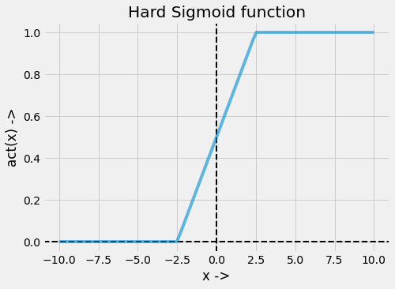


---
## 03. ReLU


\begin{align}
ReLU(x)= max(x,0)
\end{align}


```python
def relu(x):
    return np.where(x>0, x, 0)
```


```python
plot_graph(x, relu(x), title="ReLU", 
           LABEL=r"$ReLU(x)= max(x,0)$");
```


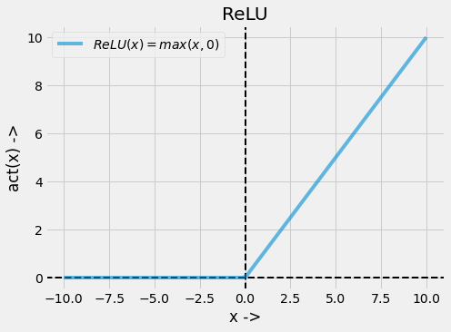


---
## 04. ELU

\begin{align}
elu(x, \alpha) = \left\{\begin{matrix}
x & x>0\\ 
\alpha * (e^{x} - 1) & x \leq 0 
\end{matrix}\right.
\end{align}


\begin{align}
\alpha\ = scaler\ slope\ of\ negative\ section
\end{align}


```python
def elu(x, alpha=0.1):
    return np.where(x>0, x, (alpha * (np.exp(x) - 1)))
```


```python
plot_graph(x, elu(x), title="ELU");
```


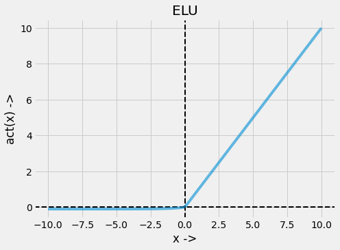


---
## 05. SELU

\begin{align}
selu(x) = scale * elu(x, \alpha)
\end{align}


```python
def selu(x, alpha=0, scale=1):
    return np.where(x>0, x, (alpha * (np.exp(x) - 1))) * scale
```


```python
plot_graph(x, selu(x, alpha=2, scale=3), title="SELU",
           LABEL=r"$selu(x) = scale * elu(x, \alpha)$");

```


---
## 06. Tanh

\begin{align}
tanh(x) = \frac{(e^{x} - e^{-x})}{(e^{x} + e^{-x})}
\end{align}


```python
def tanh(x):
    return np.tanh(x)
```


```python
plot_graph(x, tanh(x), title="Hyperbolic Tangent",
           LABEL=r"$tanh(x) = \frac{(e^{x} - e^{-x})}{(e^{x} + e^{-x})}$");
```


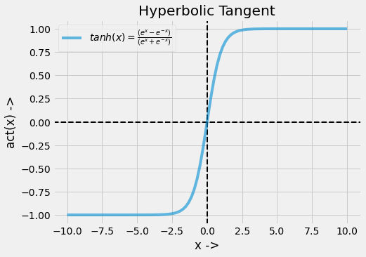


---
## 07. Softsign

\begin{align}
softsign(x) = \frac{x}{|x| + 1}
\end{align}


```python
def softsign(x):
    return x / (np.abs(x) + 1)
```


```python
plot_graph(x, softsign(x), title="Soft Sign",
           LABEL=r"$softsign(x) = \frac{x}{|x| + 1}$")
```


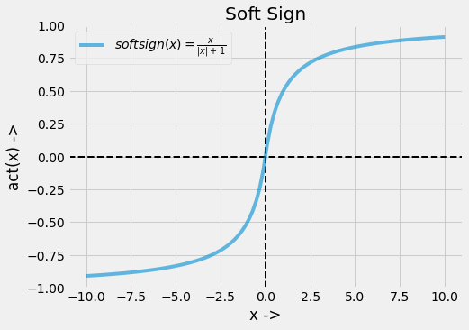


---
## 08. Softplus

\begin{align}
softplus(x)=log(e^{x}+1)
\end{align}


```python
def softplus(x):
    return np.log(np.exp(x) + 1)
```


```python
plot_graph(x, softplus(x), title="Softplus",
           LABEL=r"$softplus(x)=log(e^{x}+1)");
```


---
## 09. LeakyReLU

\begin{align}
leaky\_relu(x, \alpha) = \left\{\begin{matrix}
x & x\geq0\\ 
\alpha x & x \lt 0 
\end{matrix}\right.
\end{align}


```python
def leaky_relu(x, alpha=0.3):
    return np.where(x>=0, x, alpha*x)
```


```python
plot_graph(x, leaky_relu(x), title="Leaky ReLU");
```


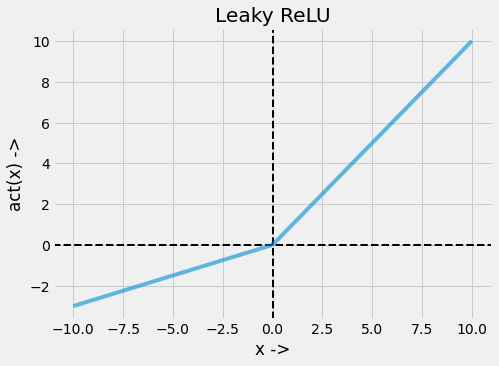


---
## 10. Threshold Relu

\begin{align}
threshold\_relu(x, \theta) = \left\{\begin{matrix}
x & x \gt \theta\\ 
\theta & x \leq \theta 
\end{matrix}\right.
\end{align}


```python
def threshold_relu(x, theta=1.0):
    return np.where(x>theta, x, theta)
```


```python
plot_graph(x, threshold_relu(x), title="Threshold ReLU");
```


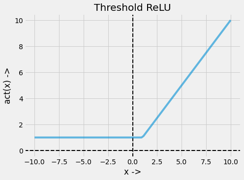


---
## 11. Maxout

---
## 12. Swish


```python
def swish(x):
    def _sigmoid(x):
        return 1 / (1 + np.exp(-x))
    return x*_sigmoid(x)
```


```python
plot_graph(x, swish(x), title="Swish")
```


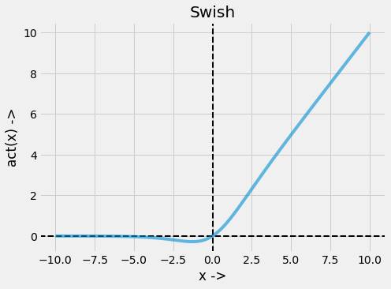


---
## Softmax
\begin{align}
p_k = softmax(z)_k = \frac{e^{z_k}}{\sum_{j=1}^{j=K}e^{z_j}}
\end{align}


<br>

| symbol | meaning |
| :---: | :---: | 
| k | $k^{th}$ class |
| K | K no. of classes | 
| $p_k$ | proba. that instance belong to $k^{th}$ class | 


```python
def softmax(x):
    data = [np.exp(i)/sum(np.exp(x)) for i in x]
    print(data)
    return data
```


```python
plot_graph(x, softmax(x))
```

    [3.7702947552292645e-10, 4.614360944651457e-10, 5.647390538363874e-10, 6.911687290039416e-10, 8.459025610283457e-10, 1.0352770788480414e-09, 1.2670473874498868e-09, 1.5507047483654598e-09, 1.8978652577808946e-09, 2.3227455390772242e-09, 2.8427449299596202e-09, 3.4791580054100983e-09, 4.2580466151006775e-09, 5.211307146205107e-09, 6.377976717252612e-09, 7.80583179316895e-09, 9.553344686635031e-09, 1.1692078066750944e-08, 1.4309615532897714e-08, 1.751314826417752e-08, 2.1433864621864873e-08, 2.6232322464153233e-08, 3.210502417568443e-08, 3.9292463666905155e-08, 4.808897487715875e-08, 5.8854785089075336e-08, 7.203076665139143e-08, 8.815649121026662e-08, 1.0789232579070012e-07, 1.320464755880721e-07, 1.6160808090332472e-07, 1.9778772357946008e-07, 2.4206700172466524e-07, 2.962592028641672e-07, 3.6258356015638823e-07, 4.437561325511226e-07, 5.431010305370568e-07, 6.64686542301323e-07, 8.134917348243602e-07, 9.956103524171359e-07, 1.2185003625810541e-06, 1.491289368381424e-06, 1.825148394323547e-06, 2.2337493526942496e-06, 2.7338249241433775e-06, 3.345853780260961e-06, 4.094899208805175e-06, 5.011635484251619e-06, 6.133604014722144e-06, 7.506750705959118e-06, 9.187307499173531e-06, 1.1244095133912657e-05, 1.3761341436743205e-05, 1.6842130547923253e-05, 2.061262433587435e-05, 2.5227228871246985e-05, 3.087491753365241e-05, 3.778696968957722e-05, 4.6246441849268766e-05, 5.659975915739356e-05, 6.9270901902383e-05, 8.477876799839266e-05, 0.00010375842245354131, 0.00012698710401467118, 0.00015541605399073356, 0.00019020947068184197, 0.0002327921846428017, 0.0002849080071381617, 0.0003486911412253416, 0.0004267535798320687, 0.0005222920698802373, 0.0006392190227604585, 0.0007823227320922742, 0.0009574634598721453, 0.0011718134209632186, 0.0014341504935685813, 0.0017552176834707616, 0.0021481630625127582, 0.0026290781973090016, 0.0032176571174631135, 0.003938002808801287, 0.00481961425844951, 0.0058985944723895555, 0.007219128935206099, 0.008835295056657342, 0.010813276703994113, 0.01323407450768015, 0.016196822930660573, 0.019822849938991242, 0.024260645522025094, 0.02969194252878999, 0.03633915883782225, 0.04447450562589664, 0.05443113472976735, 0.06661678159824051, 0.08153046252920995, 0.09978290996277277, 0.12212158267925462, 0.14946127509861257, 0.18292157916733134]


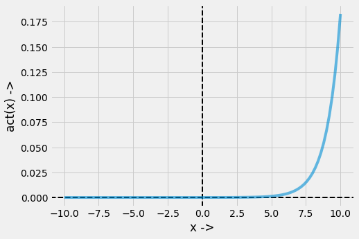


```python
plot_graph(np.random.randint(1,5,5), softmax(np.random.randint(1,5,5)))
```

    [0.023163658230010892, 0.46525451265498363, 0.46525451265498363, 0.023163658230010892, 0.023163658230010892]


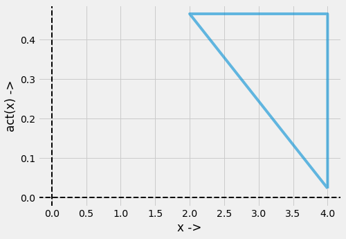


```python
arr = np.arange(1,5)
print(arr)
data = [round(np.exp(i)/sum(np.exp(arr)), 7) for i in arr]
print(data)
data = (np.exp(arr)/sum(np.exp(arr)))
print(data)

```

    [1 2 3 4]
    [0.0320586, 0.0871443, 0.2368828, 0.6439143]
    [0.0320586  0.08714432 0.23688282 0.64391426]

